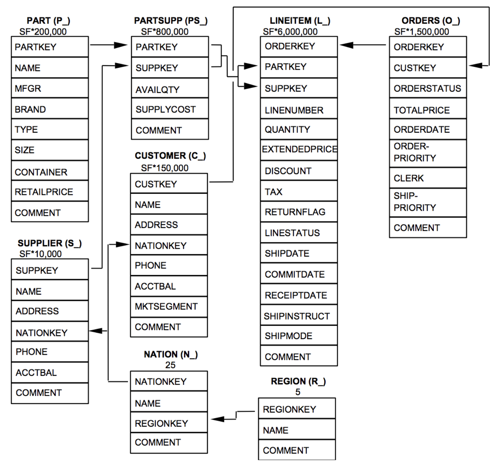
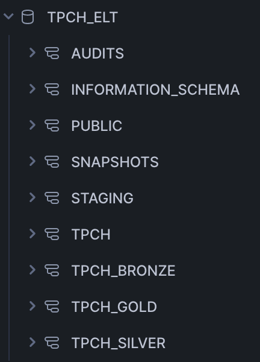
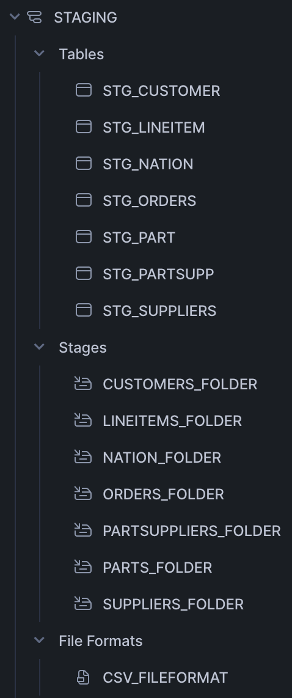
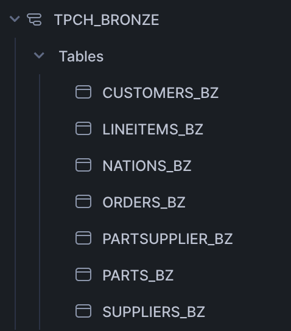
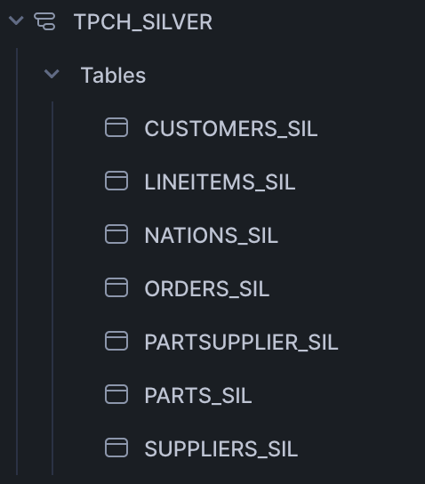
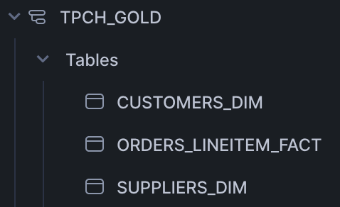
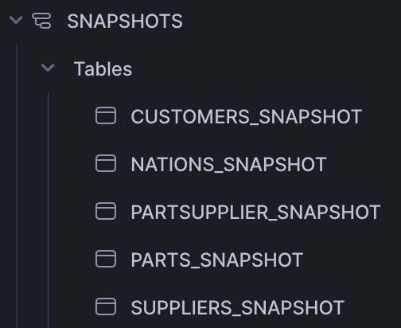

# Overview
This project implements a data pipeline for the TPC-H dataset, utilizing Amazon S3 for data storage, Snowflake as the data warehouse, dbt for data transformations, and Apache Airflow for orchestration. The pipeline processes and transforms the raw CSV data into analytical tables for reporting and analysis.

# Tech Stack used:
- Amazon S3: Cloud storage service to store raw CSV files.
- Snowflake: Cloud-based data warehouse for storing, querying, and transforming data.
- dbt (Data Build Tool): A transformation tool for managing and executing SQL models in Snowflake.
- Apache Airflow: Workflow orchestration tool for managing the scheduling and execution of tasks.

# Datasets
- Customers
- Line item
- Nation
- Orders
- Part
- Parts Supplier
- Region
- Supplier

# ER Diagram:

# Snowflake database structure

### Schema structure

#### Staging schema structure

- This is a landing zone into snowflake environment where all the raw data files from s3 are loaded into landing zone in snowflake
- Stages and file formats are created to load csv files from s3
- Storage integration method is used to create connection between s3 and snowflake
#### Bronze schema structure

- Data are picked from staging and applied data cleaning transformations such as data type conversion, null handling, text cleaning (trimming extra spaces)
#### Silver schema structure

- Data are ingested incrementally and applied transformations so that only the new incoming data is processed.
#### Gold schema structure

- Data are ingested in facts and dimensions to enable faster analytical queries
#### Snapshot schema structure

- The dimension tables such as customer, nation, part, supplier, part supplier are separately maintained in snapshot schema by implementing SCD type 2 so that historical changes can be maintained in a table.
#### Audits schema structure

- Audit schema is implemented for better auditing the tables.