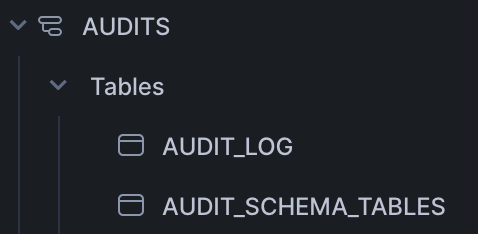

# Introduction

# Requirements

# Tech Stack used:
- S3
- Snowflake
- DBT
- Airflow

# Datasets
- customers
- line item
- Nation
- Orders
- Part
- Parts Supplier
- Region
- Supplier

# ER Diagram:

# Snowflake database structure

### Schema structure

#### Staging schema structure

- This is a landing zone into snowflake environment where all the raw data files from s3 are loaded into landing zone in snowflake
- Stages and file formats are created to load csv files from s3
- Storage integration method is used to create connection between s3 and snowflake
#### Bronze schema structure

- Data are picked from staging and applied data cleaning transformations such as data type conversion, null handling, text cleaning (trimming extra spaces)
#### Silver schema structure

- Data are ingested incrementally and applied transformations so that only the new incoming data is processed.
#### Gold schema structure

- Data are ingested in facts and dimensions to enable faster analytical queries
#### Snapshot schema structure
- The dimension tables such as customer, nation, part, supplier, part supplier are separately maintained in snapshot schema by implementing SCD type 2 so that historical changes can be maintained in a table.
#### Audits schema structure

- Audit schema is implemented for better auditing the tables.

# Solution:
